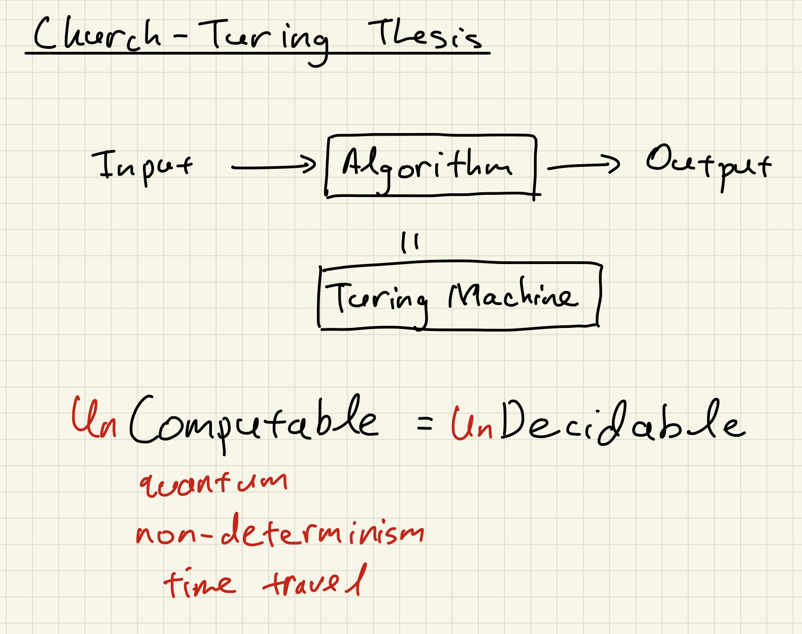

# Limits of Computation

In this section, we discuss the limits of computation and show that
there are some uncomputable problems.

Before we go further, let us clarify what we mean by *computable*. The
Church-Turing Thesis is equivalent to the statement that every
computable problem can be solved by a Turing machine. Moreover, we
expect that a computational process should always complete in finite
time and not run forever. Thus, we will use decidable to mean computable
and consequently, undecidable problems are uncomputable.

Note that decidable only means that the computation will *eventually*
terminate. This allows for computation that takes exponential time and
space, for example. For actual applications, we also want computation to
be *efficient*.

Thus, the Church-Turing Thesis implies that undecidable problems cannot
be solved even if we allow the computation to run for an impractical
amount of time and space. Even worse, it means that there is no future
physical hardware or algorithmic technique that can be invented that
will solve these problems.

::: {aside}

No, ChatGPT 5000 with quantum neural networks cannot solve these
problems either.

:::

At a practical level, understanding the limits of computation is
important as there are natural problems that have practical applications
that are undecidable. These include a vast array of problems in program
analysis such as deciding if a given program can ever run into an
infinite loop, and deciding if two programs have equivalent behavior.

Being able to identify whether a problem is undecidable is useful as it
saves us time designing an algorithm for the problem.
